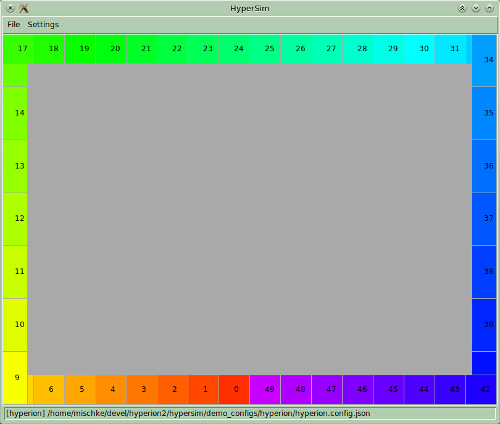
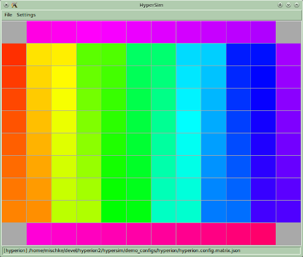
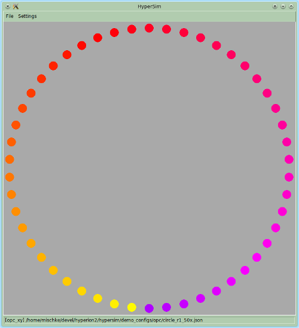
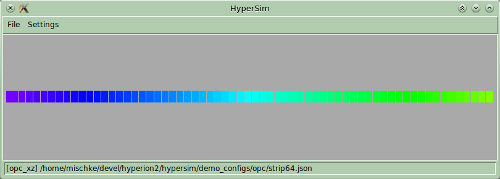
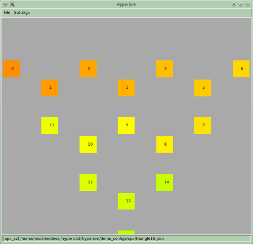

# HyperSim
LED-Simulator for hyperion and open pixel control.

This is a python/TK app that can load [hyperion](https://github.com/tvdzwan/hyperion) and [hyperion.ng](https://github.com/hyperion-project/hyperion.ng) config files
or [open-pixel-control/OPC](http://openpixelcontrol.org/) layout file and visualize the LED configuration.
In addition it opens a OPC server where you can feed the virtual LEDs with real color from hyperion/opc client.

## Requirements
- python 3
- Tkinter support (windows: it comes with standard py3 install. Linux: there are packages)
- source of OPC messages like OLA, Hyperion, OPC-Clients
- a json config file with your led layout (e.g. hyperion config, hyperion-ng LED layout, OPC layouts)
- Hyperion/Hyperion-NG: Ensure you have the latest hyperiond

## Usage

### client: Hyperion
use the fadecandy driver. (default port is 7890)

hyperion.config.json:
```
"device" :
{
  "name"       : "MyPi",
  "type"       : "fadecandy",
  "output"     : "127.0.0.1"
},
```
### client: Hyperion-NG
Setup a LED-device via the Web-UI:
```
Configuration -> LED Hardware -> LED Controller -> Controller type: "fadecandy" 
```

Specific Settings:
```
Target IP   : 127.0.0.1
Port        : 7890
```

#### Create an Hyperion-NG LED-Layout file

Configure the LED-Layout via the Web-UI:
```
Configuration -> LED Hardware -> LED Layout -> Classic Layout or Matrix Layout
```

Get the LED-layout definition via:
```
Generated/Current LED Configuration -> Update Preview
```

Copy the content of the text field and save it as a hyperion-ng LED-layout file to be used by the HyperSim server.

### client: generic OPC

configure your client to your HyperSim IP-address and port 7890
use the same LED-layout as the server.

### server: HyperSim
```
usage: hypersim [-h] [-n] [-c | -r] --hyperion <file> | --opc_xy <file> |
                --opc_yz <file> | --opc_xz <file>] [--led_size <pixel>]
                [--port <port>]

Simulator for hyperion.

optional arguments:
  -h, --help          show this help message and exit
  -n, --num           show led IDs
  -c, --circle        draw led as circle/oval
  -r, --rect          draw led as rect (default)
  --hyperion <file>   hyperion config
  --opc_xy <file>     opc config xy components
  --opc_yz <file>     opc config yz components
  --opc_xz <file>     opc config xz components
  --led_size <pixel>  pixel size of a single led (default: 15)
  --port <port>       set port of OPC-server (default: 7890)
  -w, --wide          set to 16:9 format
```

Configuration file can be opened via file menu.

If all works fine you should see something similar like that:










